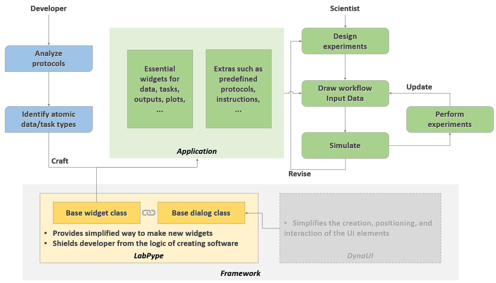

# ExpCatalyst
ExpCatalyst provides a solution for rapid development of pipeline and workflow management software. A visualized pipeline software provides features such as reusability of workflows, user-friendly interface, and highly integrated functionalities. ExpCatalyst accelerates the making of such software for developers. It also helps the scientists become the developers to meet their increasing and diverging needs.

## Dependencies
* Python (>= 3.5)
* wxPython (>= 3.0.3)
* [DynaUI](https://github.com/yadizhou/DynaUI)

## Concept


## For users
A visualized pipeline software has many advantages:
* Centralized. There is less need to switch between multiple programs. Data management and processing are integrated.
* Visualized. It allows users to focus on the experiment logic, and saves users from having to use command lines.
* Interactive. Users can try different workflows, inputs, and parameters, and can get feedback in real time.
* Extensible. Functions can be extended by user-developed widgets.
* Reusable. Workflows (or part of the workflow) can be reused to reduce repetitive tasks.
* Sharable. Workflows can be shared.

#### How to use
Users draw a workflow by adding and linking the widgets, and set input for the data widgets or the parameters for the task widgets using their dialogs. Then users can choose to run certain tasks manually, or just run the final task. Widgets will automatically trace back to determine what upstream tasks need to be done first. The results can be either displayed in the task widget’s dialog, or in specialized output widgets.

#### Examples
[See Examples Here](https://ncbi-hackathons.github.io/ExpCatalyst/)

## For developers
ExpCatalyst tries to minimize the efforts of developers to make a widget-based pipeline software. It handles things such as GUI, resource management, workflow logic, etc., that are universal in pipeline software. It exposes two main base classes, "widget" and "dialog", to developers. The base widget class knows how to act in a workflow. Developers just need to subclass it, specify a few attributes, and implement the task it does. Each widget may have an associated dialog for interaction. The base dialog class has many APIs for easy creation of various UI elements.

#### How to make new widgets
Let’s use summation of numbers as our toy example. The input widget’s data type is number, and the task widget simply sum all the numbers passed to it and display the result.

Code in `mywidget.py`:
```python
class ANCHOR_NUMBER(ANCHOR_REGULAR): pass
class ANCHOR_NUMBERS(ANCHOR_REGULAR): pass
LegitLink.Add(ANCHOR_NUMBER, ANCHOR_NUMBER, False)
LegitLink.Add(ANCHOR_NUMBER, ANCHOR_NUMBERS, False)

class Number(Widget):
    NAME = "Number"
    DIALOG = mydialog.Number
    INTERNAL = "NUMBER"
    OUTGOING = ANCHOR_NUMBER

    def Task(self):
        return float(self["NUMBER"])

class Summer(Widget):
    NAME = "Summer"
    INCOMING = ANCHOR_NUMBERS, "NUMBERS", True, "L"
    OUTGOING = ANCHOR_NUMBER # The output can be the input for the next summer

    def Name(self):
        if self.IsDone():
            return "+".join(str(i) for i in self["NUMBERS"]) + "=" + str(self["OUT"])

    def Task(self):
        return sum(self["NUMBERS"])
```

Code in `mydialog.py`:
```python
class Number(Dialog):
    def Initialize(self, Sizer):
        self.Number = self.AddLineCtrl(Sizer, label="Number", value="")

    def SetData(self):
        self.Widget["NUMBER"] = self.Number.GetValue()

    def GetData(self):
        if self.Widget["NUMBER"] is not None:
            self.Number.SetValue(str(self.Widget["NUMBER"]))
```

#### Features
* Subclassing of `Widget` and `Dialog` is simple and flexible. (see `demo` and `builtin`)
* Widget tasks can run in parallel using either multithreading or multiprocess. (see `demo`)
* Dialogs can be generated automatically, meaning no coding needed for the look and interaction of dialogs.
* Builtin widgets are growing!
* Builtin data fields are growing!
* GUI is fully implemented and is ready to use. Color/font/image are customizable. (see `resource.py`)
* Software localization is as simple as editing a txt file. (see `locale.py`).


