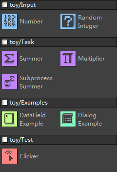
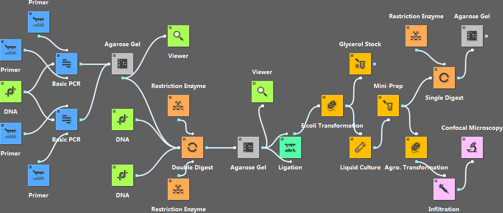
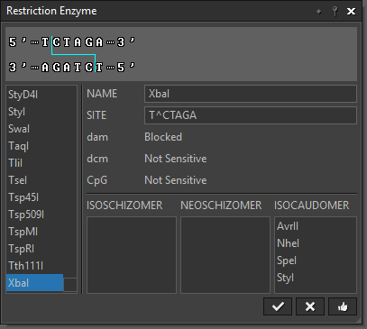
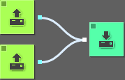
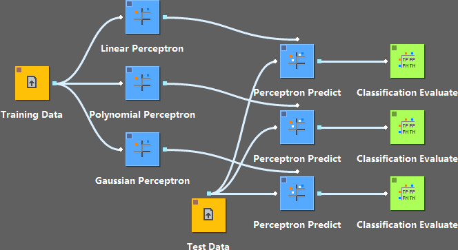

# LabPype
LabPype is a software and a framework implemented in Python.

As a software, LabPype helps you create highly interactive workflows efficiently.
It is based on the idea that a workflow consists of a series of widgets, each representing a type of data or a task to be executed.
LabPype allows you to reuse the tasks or data from a previous workflow to construct new workflows with minimal repetition.

As a framework, LabPype tries to minimize the efforts needed to make new widgets.
It handles GUI, resource management, workflow logic, etc., that are universal in pipeline software.
It provides two main base classes to developers. The base widget class knows how to act in a workflow.
To make a new widget, a developer just need to subclass the base widget, specify a few attributes, and implement its task, or wrap an already implemented function.
Each widget may have an associated dialog for user interaction. The base dialog class has many APIs to simplify the creation of various UI elements.

We are going to see four examples here.
The first example demonstrates the basic idea of LabPype and how to develop widgets using LabPype.
The second example shows how it assists the design of a specific wet lab experiment.
In the third example, several widgets are combined in different ways to illustrate the flexibility of LabPype.
The last example shows three main ways to implement tasks in LabPype.

 

### Example 1: Toy widget set

This toy widget set shows the basic ideas of LabPype. Each widget has several anchors for making connections.
The output of a widget will be sent to all the widgets that are connected to its output anchor (cyan rectangle).
When you run a downstream task, LabPype will schedule all the upstream tasks and perform them.
When you change the data of a widget, all downstream tasks will be reset.
Tasks can run in a separate thread to avoid blocking the GUI (See "Summer" and "Multiplier").
A widget can also start a subprocess, which is illustrated in "SubprocessSummer".
LabPype provides many features that make widget making efficient. Check out the source code of this widget set to learn more: [LabPype-ToyWidget](https://github.com/yadizhou/LabPype-ToyWidget).
A convenient way to install this widget set is to open the widget manage dialog, click "Download from repository", leave the url blank and click ok.

| Widget set | Example Workflow | Docked Dialogs |
| --- | --- | --- |
|  |  |  |

Here are some other widgets in this package:

| Widget | Dialog | Note |
| --- | --- | --- |
|  |  | "Clicker" is used for testing the stability of LabPype. Add this widget to the canvas and run it. It will constantly start/stop other widgets on the canvas in a fast and random fashion. |
|  |  | This example shows how to use DataField as internal input type for automatic generation of dialogs. [See source code](https://github.com/yadizhou/LabPype-ToyWidget/blob/533273079a1811769e1e51de4a8420f15b77c21e/toy/widget.py#L122) |
|  |  | This example shows how to define your own dialog and link the UI elements with data in the widget. [See source code](https://github.com/yadizhou/LabPype-ToyWidget/blob/533273079a1811769e1e51de4a8420f15b77c21e/toy/dialog.py#L17) |

 

### Example 2: Cloning widget set
The workflow below gives a clear layout of the steps in using bimolecular fluorescence complementation to test the interaction between two proteins.
This workflow makes the experiment design very intuitive. User can modify the input (e.g., primers, DNA sequences, enzymes, etc.) and simulate the experiment to get hypothetical results in real time.

* Users can interact with the widgets. For example, we can input the primers, choose what enzymes to use, etc.
* It simulates the PCR and digestion experiments, and gives the hypothetical sequences produced. If a mistake is made in the design of the primers, the downstream steps will send warnings showing that the job cannot be done.
* Besides simulating experiments, the widgets show additional information related to a particular step. For example, the "Double Digest" widget can show the proper buffer for reaction of the two enzymes passed to it.
* For steps such as "Mini-Prep" and "Glycerol Stock", simulation isn't necessary; but instructions for those steps will show up in their dialogs.
* A workflow can be easily redesigned by changing the input of its widgets or replacing existing widgets with new ones. For example, we can replace the "cDNA" widget with an "Entrez Efetch" widget to directly get the sequence from GenBank.

| Widget/Workflow | Dialog | Note |
| --- | --- | --- |
|  |  | "DNA" lets you load a sequence file or directly input a sequence. |
|  |  | "Primer" lets you select a primer from a predefined primer database. |
|  |  | "Restriction Enzyme" lets you select a restriction enzyme from an internal RE database. |
|  |  | This workflow represents two PCR reactions that use the same set of primers but different templates. |

 

### Example 3: Biopython widget set
This example shows what users can do with just four widgets. These four widgets are simply wrappers for functions from Biopython package.
With LabPype, we can quickly write wrappers for functions from popular libraries.
Check out the source code of this widget set to learn more: [LabPype-BioPype](https://github.com/yadizhou/LabPype-BioPype).

| Widget set | Note |
| --- | --- |
|  | **LoadFile** - load a FASTA or GenBank file, and send sequence records to downstream widgets  **SaveFile** - save the records received from upstream widgets to either FASTA or GenBank file  **NewRecord** - let user input sequence directly  **ViewSequence** - show the sequences sent to it |

| Scheme | Task |
| --- | --- |
|  | Show the sequence loaded from file |
|  | Save input(s) to a sequence file View the sequence |
|  | Convert a file to another format |
|  | Merge files |
|  | Append a record to a file |

What we can do is not predetermined by what widgets we have. It is also determined by how we connect them.

 

### Example 4: Machine learning widget set
The tasks in this example were written in three different ways: tasks were directly implemented in the widget; widgets were wrappers for other libraries; widgets were wrappers for external tools.

| Widget set | Note |
| --- | --- |
|  | **File** - specify a file path (does not load the file) **LoadData** - load a TSV/CSV/SVM format file **LRTrain** - train a linear regression model using directly implemented functions **LRPredict** - use a trained model to predict a new sample **PerceptronTrain** - train a perceptron model in a separate thread **PerceptronPredict** - predict a new sample using a perceptron model **LIBSVMTrain** - serve as an interface for the external svm-train.exe **LIBSVMPredict** - serve as an interface for the external svm-predict.exe **RegressionEvaluate** - show RMSE **ClassificationEvaluate** - show confusion matrix, accuracy, SE, SP, and AUC **PlotScatter** - create a scatter plot |

A typical case of using linear regression looks like this:  

 

Here we use the same training data to train the perceptron model with three different kernels, and evaluate the results by a test data set.  

 

This example is basically equal to directly calling the "svm-train" and "svm-predict". However, we can reuse the file path or the modeling parameters.
In addition, the "LIBSVMPredict" not only calls the "svm-predict", but also loads the predicted results once it's done; evaluation can be conducted following that, as in the perceptron case.  

