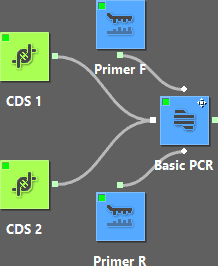
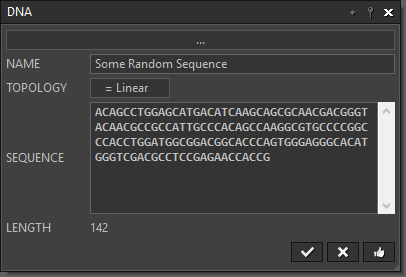
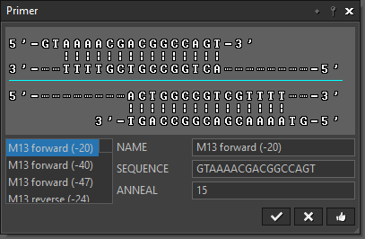
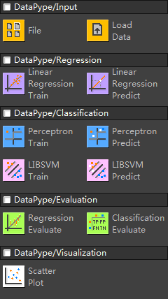
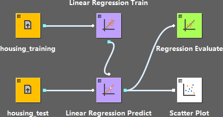

# LabPype
LabPype is a software and a framework implemented in pure Python language.

As a software, LabPype helps you efficiently create highly interactive workflows. It is based on the idea that a workflow consists of a series of widgets, each representing a type of data or task that can be executed. LabPype lets you reuse the tasks or data in a previous workflow to construct new workflows with minimal repetition. When designing your lab tasks, whether dry or wet, you can benefit from using LabPype with a suitable set of widgets. 

As a framework, LabPype tries to minimize the efforts needed to make new widgets. It handles things such as GUI, resource management, workflow logic, etc., that are universal in pipeline software. It exposes two main base classes to developers. The base widget class knows how to act in a workflow. Developers just need to subclass it, specify a few attributes, and implement the task it does, or wrap a function that is already implemented. Each widget may have an associated dialog for interaction. The base dialog class has many APIs to simplify the creation of various UI elements.

We are going to see four examples here. The first example demonstrates the basic idea of LabPype and how to develop widgets using LabPype. The second example shows how it assists the design of a specific wet lab experiment. The third example demonstrates its flexibility by combining widgets. The last example shows three main ways to implement tasks in LabPype.

#### Example 1: Toy widget set

| Widget set | Example Workflow | Docked Dialogs |
| --- | --- | --- |
|  |  |  |

| Widget | Dialog | Explain |
| --- | --- | --- |
|  |  | TODO |
|  |  | TODO |
|  |  | TODO |

#### Example 2: Cloning widget set
The following workflow demonstrate the steps of how to use bimolecular fluorescence complementation to test the interaction between two proteins. This workflow makes the experiment very intuitive. User can modify the input (e.g., primers, DNA sequences, enzymes, etc.) and simulate the experiment to get the hypothetical result in real time.

* This workflow gives a clear layout of the steps in this experiment.
* Users can interact with the widgets. For example, we can input the primers, choose what enzyme to use, etc.
* It simulates the PCR and digestion experiments, and gives the hypothetical sequences produced. If a mistake is made in the design of the primers, some downstream step will send a warning by showing that the job cannot be done.
* Besides simulating experiments, the widgets show additional information related to a particular step. For example, the Double Digest widget can show the suitable buffer for reaction for the two enzymes passed to it.
* For steps such as "Mini-Prep" and "Glycerol Stock", simulation isn't necessary; but instructions for those steps will show up in their dialogs.
* A workflow can be easily redesigned by changing the input of its widgets or replacing existing widgets with new ones. For example, we can replace the "cDNA" widget with an "Entrez Efetch" widget to directly get the sequence from GenBank.

The following workflow represents two PCR reactions that use the same set of primers and different templates.  

 This "DNA" widget lets you load a sequence file or directly input some sequence.  

 This "Primer" widget lets you select a primer from a predefined prime database.  

 This "Restriction Enzyme" widget lets you select a restriction enzyme from an internal RE database.  

#### Example 3: Biopython widget set
This example shows what users can do with just four widgets:  

| Widget set | Function |
| --- | --- |
|  | **LoadFile** - loads a FASTA or GenBank file, and sends sequence records to downstream widgets **SaveFile** - saves the records received from upstream widgets to either FASTA or GenBank file **NewRecord** - lets user input sequence directly **ViewSequence** - shows the sequences sent to it |

These four widgets are simply wappers for functions from Biopython package.

| Task | Scheme |
| --- | --- |
| Show the sequence loaded from file |  |
| Save input(s) to a sequence file View the sequence |  |
| Convert a file to another format |  |
| Merge files |  |
| Append a record to a file |  |

#### Example 4: Machine learning widget set

